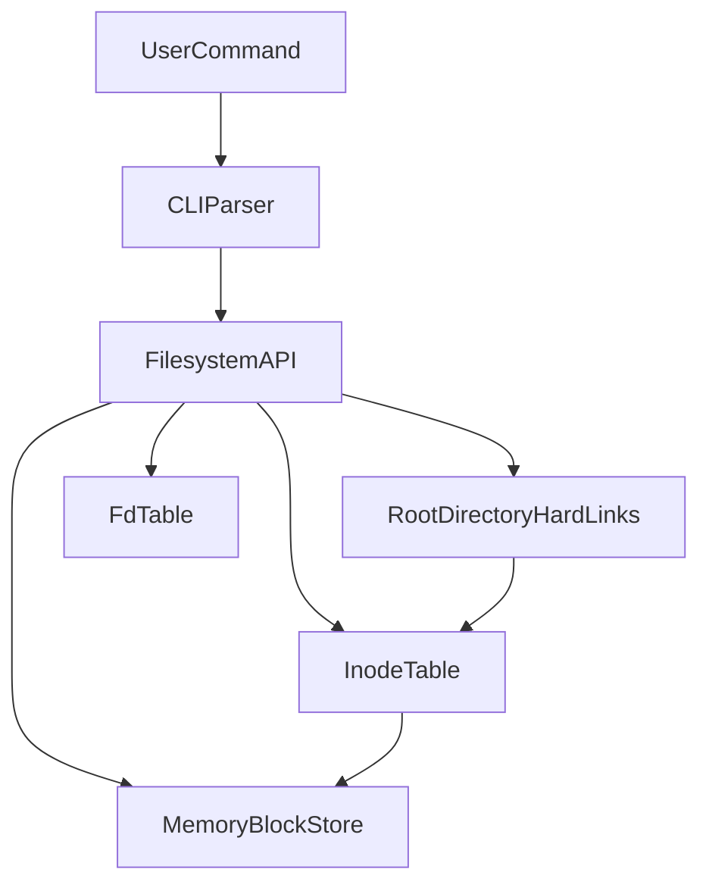

# Архітектура ФС для LAB4

Ваша ідея з `hard link` та `inode` правильна як основа, але в поточному вигляді вона **недостатня** для вимог лабораторної. Треба додати блочний шар і семантику відкритих файлів.

## Що залишаємо з вашої ідеї

- `hard link` (запис директорії): `name + inode_id`.
- `inode`: метадані файлу і лічильник hard links.
- Дані файлу адресуються через `inode`.

## Що обовʼязково довершити

- Додати **тип файлу** в inode (`regular` / `directory`), навіть якщо директорія одна.
- Додати **мапу блоків** файлу в inode (прямі блоки + 1 непрямий масив індексів), або еквівалентну структуру для memory-backend.
- Додати **таблицю відкритих файлів** (`fd table`) з власним `offset` на кожен `fd`.
- Реалізувати правильний життєвий цикл inode:
  - `unlink` зменшує `link_count`;
  - inode видаляється лише коли `link_count == 0` і файл не відкритий.
- Реалізувати **sparse/zero optimization**: не виділяти блоки, повністю заповнені нулями при `truncate`/`write`.

## Рекомендована структура проєкту

- [main.c](/home/rgd/projects/SP/LAB4/main.c) — старт програми, запуск REPL.
- [/home/rgd/projects/SP/LAB4/rfilesystem/filesystem.h](/home/rgd/projects/SP/LAB4/rfilesystem/filesystem.h) — публічні типи та API.
- [rfilesystem/filesystem.c](/home/rgd/projects/SP/LAB4/rfilesystem/filesystem.c) — високорівневі операції ФС (`create`, `link`, `unlink`, `stat`, `truncate`, `ls`, `open`, `close`, `seek`, `read`, `write`).
- [rfilesystem/inode.h](/home/rgd/projects/SP/LAB4/rfilesystem/inode.h) + [rfilesystem/inode.c](/home/rgd/projects/SP/LAB4/rfilesystem/inode.c) — inode-таблиця, розмір, блокова карта файла.
- [rfilesystem/directory.h](/home/rgd/projects/SP/LAB4/rfilesystem/directory.h) + [rfilesystem/directory.c](/home/rgd/projects/SP/LAB4/rfilesystem/directory.c) — одна root-директорія: пошук імені, вставка, видалення, позначення невалідних записів.
- [rfilesystem/block_store.h](/home/rgd/projects/SP/LAB4/rfilesystem/block_store.h) + [rfilesystem/block_store.c](/home/rgd/projects/SP/LAB4/rfilesystem/block_store.c) — memory backend блоків (allocate/free/read/write/zero-check).
- [rfilesystem/fd_table.h](/home/rgd/projects/SP/LAB4/rfilesystem/fd_table.h) + [rfilesystem/fd_table.c](/home/rgd/projects/SP/LAB4/rfilesystem/fd_table.c) — таблиця відкритих файлів (`fd -> inode_id, offset, flags`).
- [cli/repl.c](/home/rgd/projects/SP/LAB4/cli/repl.c) + [cli/parser.c](/home/rgd/projects/SP/LAB4/cli/parser.c) — парсинг і виконання команд.

## Потік даних (спрощено)

## Порядок реалізації (мінімальний ризик)

1. Базові структури (`inode`, `directory entry`, `block store`, `fd table`) і ініціалізація ФС.
2. Іменування файлів: `create`, `link`, `unlink`, `ls`, `stat`.
3. Відкриття файлів: `open`, `close`, `seek`.
4. Дані файлів: `read`, `write`, `truncate` з підтримкою нульових блоків.
5. REPL і демонстрація всіх команд для звіту.

## Ключові інваріанти для перевірки

- Імʼя у директорії унікальне.
- `inode.link_count == кількість валідних hard links`.
- `fd` завжди має окремий `offset`.
- Після останнього `unlink` файл ще доступний через відкриті `fd`.
- Після `close` останнього `fd` і `link_count == 0` inode та блоки звільняються.
- Читання з «дір» повертає нулі.